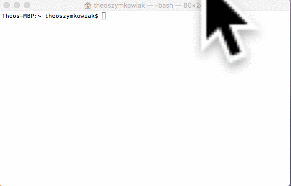

### Install

```
$ npm install -g lambdadb-cli
```

### Getting started

First, you need to sign up to LambdaDB:

```
$ lambdadb signup
```

Or, if you already have an account, sign in using:

```
$ lambdadb login
```

### Creating a database

You can create a database using:

```
$ lambdadb new <database name>
```

Then you can desctroy it whenever you want with

```
$ lambdadb delete <database name>
```

### Listing database

See all your database using:

```
$ lambdadb list
```

### Accessing your database through a SQL client

To get your SQL credentials just type:

```
$ lambdadb info
```

## Example



### Using a LambdaDB in your code

```js
var lambdaDB = require('lambdadb')({
    host: 'https://lambdadb.herokuapp.com',
    secretToken: 'my secret token',
    database: 'microservice'
})

// Easily insert into tables
lambdaDB.table('users').insert({
    username: 'user',
    password: 'pass'
}).then(function(response) {
    console.log(response.data) // => logging the trace of the SQL query 
})

// Describe tables
lambdaDB.table('users').describe().then(function(response) {
    console.log(response.data) // => logging the structure of the database
})

// Do raw operations on your database
lambdaDB.raw('SELECT * FROM users').then(function(response) {
    console.log(response.data) // => logging the rows
})

```

Visit the [LambdaDB client repository](https://github.com/Theo-/lambdaDB-client) to get started.